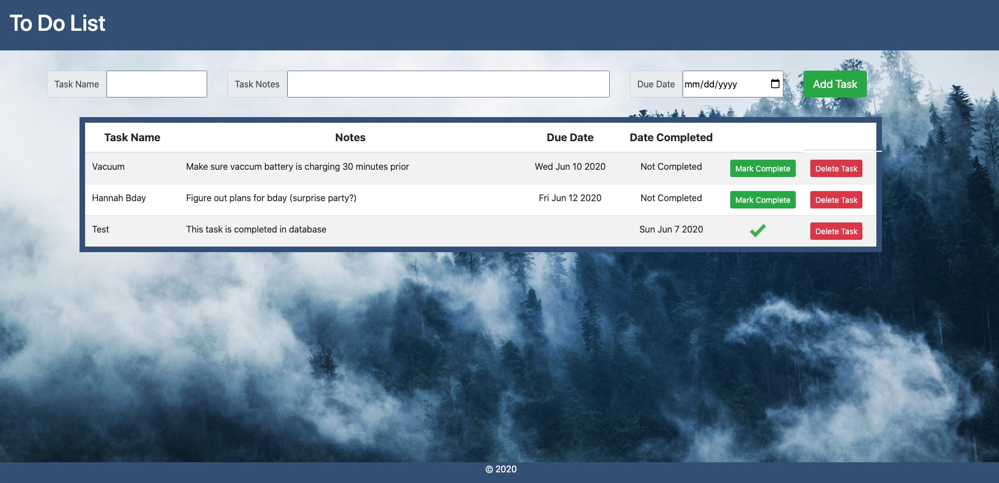

# Weekend SQL To-Do List

## Description
This application allows users to add tasks, mark tasks complete, and delete tasks off a list. It also allows for due dates to be entered to organize tasks by urgency.

## Installation
Create a database named "todo". See database.sql file in order to copy and paste text to recreate table for app. The project is built on Postgres, so you will need to make sure to have that installed. It is recommended to use Postico to run queries as that was used to create the queries,
<!-- npm install moment --save NOT USED -->
npm init --yes  <!--cant get these ot be on new lines...-->
npm install express --save 
npm install pg --save

## Screen Shot

## Prerequisites
Node.js
Bootstap

## License
MIT

## Acknowledgement
Thanks to Prime Digital Academy who equipped and helped me to make this application a reality.

## Support
If you have suggestions or issues, please email me at khagler.kh@gmail.com
